# 服务模版说明文档

## 服务说明

本文介绍基于MySQL软件包快速构建托管版单租户计算巢服务，关于计算巢托管版可以参考[帮助文档](https://help.aliyun.com/zh/compute-nest/create-a-fully-managed-service?spm=a2c4g.11174283.0.i5)，
本示例采用ECS+SLB的架构，默认支持私网打通、网络变配与磁盘扩容功能。用户部署服务实例后，可以直接通过内网访问部署在服务商的MySQL，除此之外还配置了三种套餐，分别为：

| 套餐名 | SLB规格        | ECS规格族         | vCPU与内存          | 系统盘               | 公网带宽      |
|-----|--------------|----------------|------------------|-------------------|-----------|
| 低配版 | slb.s1.small | ecs.c6.large   | 内存型c6，2vCPU 4GiB | ESSD云盘 200GiB PL0 | 固定带宽1Mbps |
| 基础版 | slb.s1.small | ecs.c6.xlarge  | 内存型c6，4vCPU 8GiB | ESSD云盘 200GiB PL0 | 固定带宽1Mbps |
| 高配版 | slb.s3.small | ecs.c6.2xlarge | 内存型c6，4vCPU 8GiB | ESSD云盘 200GiB PL0 | 固定带宽1Mbps |

本示例对应的git地址：[mysql-managed-demo](https://github.com/aliyun-computenest/mysql-managed-demo)

本示例会自动的构建计算巢服务，具体的服务构建流程为:

1. 将MySQL安装包（提前存放到该github repo中）构建为计算巢文件部署物
2. 创建计算巢服务并关联文件部署物

创建过程大约持续3分钟，当服务变成待提交后构建成功

## 部署架构

本部署架构为Slb+ECS，安全组开放3306端口，并配置了终端节点
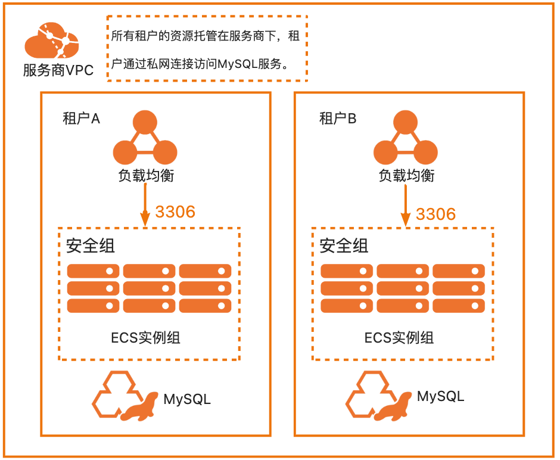

## 服务构建计费说明

测试本服务构建无需任何费用，创建服务实例涉及的费用参考服务实例计费说明

## RAM账号所需权限

本服务需要对ECS、VPC等资源进行访问和创建操作，若您使用RAM用户创建服务实例，需要在创建服务实例前，对使用的RAM用户的账号添加相应资源的权限。添加RAM权限的详细操作，请参见[为RAM用户授权](https://help.aliyun.com/document_detail/121945.html)
。所需权限如下表所示。

| 权限策略名称                              | 备注                          |
|-------------------------------------|-----------------------------|
| AliyunECSFullAccess                 | 管理云服务器服务（ECS）的权限            |
| AliyunVPCFullAccess                 | 管理专有网络（VPC）的权限              |
| AliyunROSFullAccess                 | 管理资源编排服务（ROS）的权限            |
| AliyunComputeNestUserFullAccess     | 管理计算巢服务（ComputeNest）的用户侧权限  |
| AliyunComputeNestSupplierFullAccess | 管理计算巢服务（ComputeNest）的服务商侧权限 |
| AliyunPrivateLinkFullAccess         | 管理私网连接（PrivateLink）的权限      |

## 服务实例计费说明

测试本服务在计算巢上的费用主要涉及：

- 所选vCPU与内存规格
- 系统盘类型及容量
- 公网带宽
- 私网连接费用

计费方式包括：

- 按量付费（小时）
- 包年包月

目前提供如下套餐：

| 套餐名 | SLB规格        | ECS规格族         | vCPU与内存          | 系统盘               | 公网带宽      |
|-----|--------------|----------------|------------------|-------------------|-----------|
| 低配版 | slb.s1.small | ecs.c6.large   | 内存型c6，2vCPU 4GiB | ESSD云盘 200GiB PL0 | 固定带宽1Mbps |
| 基础版 | slb.s1.small | ecs.c6.xlarge  | 内存型c6，4vCPU 8GiB | ESSD云盘 200GiB PL0 | 固定带宽1Mbps |
| 高配版 | slb.s3.small | ecs.c6.2xlarge | 内存型c6，4vCPU 8GiB | ESSD云盘 200GiB PL0 | 固定带宽1Mbps |

预估费用在创建实例时可实时看到。私网连接只有在创建服务时候并建立连接后才会计费，具体的计费方式可以参考：https://help.aliyun.com/document_detail/198081.html?spm=a2c4g.120462.0.0.5f104bffA7i9WJ

## 部署流程

### 部署参数说明

| 参数族  | 参数项               | 说明                                                            |
|------|-------------------|---------------------------------------------------------------|
| 基础配置 | 数据库root和admin账户密码 | 数据库root和admin账户密码，长度8-32个字符，可包含大小字母、数字及特殊符号（包含：!@#$%^&*-+=_）。 |
| 网络配置 | 可用区               | 选择可用区，资源将在服务商的该可用区创建                                          |
| 网络设置 | 专有网络              | 选择建立私网连接的VPC                                                  |
| 网络设置 | 安全组               | 选择建立私网连接的安全组                                                  |
| 网络设置 | 交换机和可用区           | 选择建立私网连接的可用区与交换机                                              |

### 部署步骤

0. 部署链接
   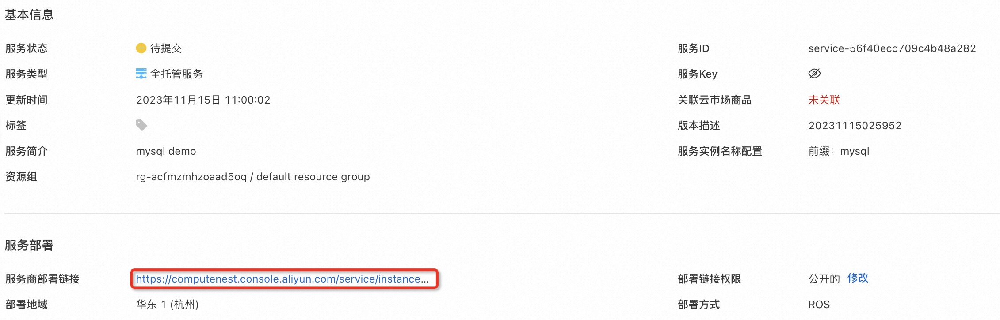
1. 单击部署链接，进入服务实例部署界面，根据界面提示，填写参数完成部署。
   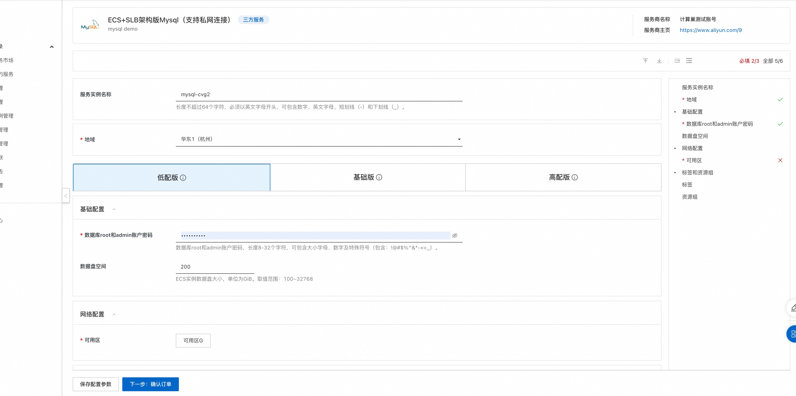
   网络设置部分如果填写网络信息，私网连接的终端节点将在该可用区创建。

   注：由于本服务开启了网络变配功能，若此处不开启私网连接，也可通过变配功能开启。详情见变配流程-变配私网连接。
   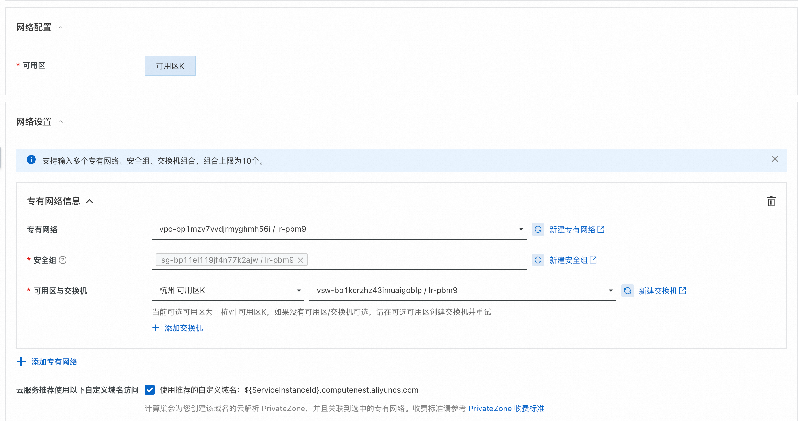
2. 参数填写完成后点击**下一步：确认订单**确认参数。
   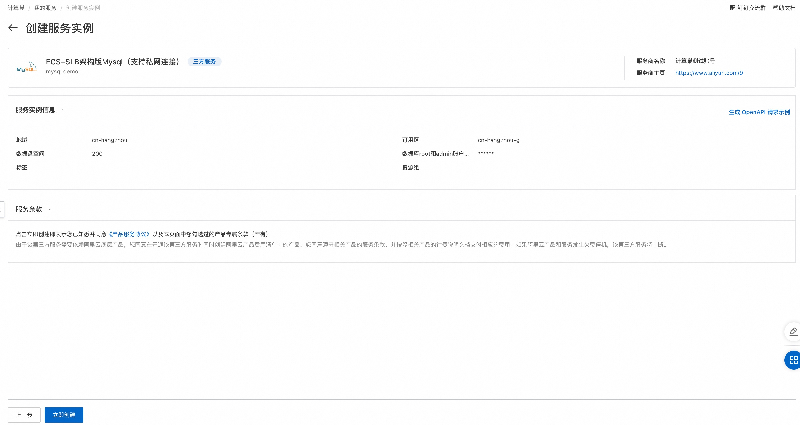
3. 确认订单完成后同意服务协议并点击**立即创建**
   进入部署阶段。
   

   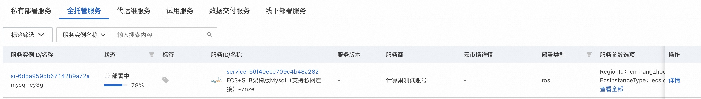
4. 等待部署完成后就可以开始使用服务
   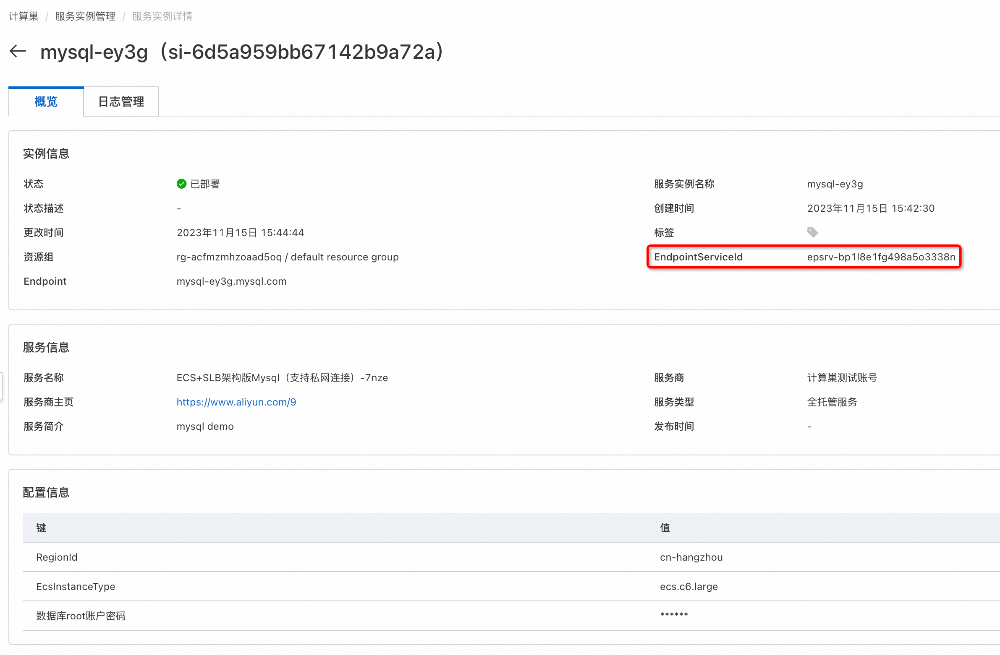
5. 使用服务，本服务支持私网访问，租户可以通过PrivateLink实现私网访问（[私网访问帮助文档](https://bp.aliyun.com/detail/186?spm=5176.9843921.content.344.4a604882OYKl3N)），
租户私网访问流程：
    1. 在服务实例的**网络配置**页签中查看详细信息，连接时可以通过自定义域名（如果在创建服务实例时勾选了的话）、IP地址或者可用区域名进行访问
       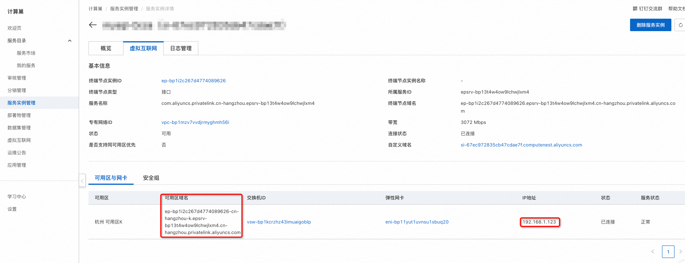
    2. 在对应的vsw中创建ECS，创建好后安装mysql客户端
   ```
   yum install mysql
   or
   apt install mysql-client
   ```
    3. 在该ECS中连接MySQL，下面展示分别用自定义域名、IP与可用区域名进行连接：

        1. 自定义域名方式访问：
           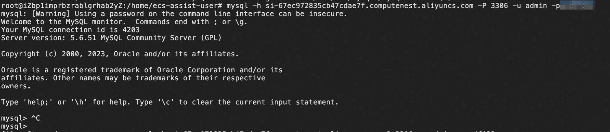
        2. 通过IP访问：
           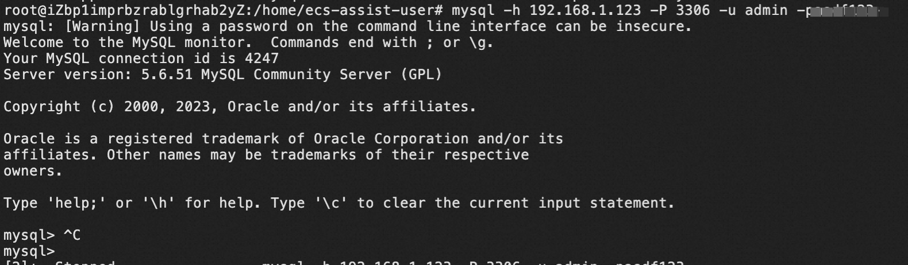
        3. 通过可用区域名访问：
           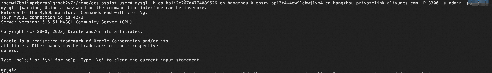
## 变配流程
        
### 说明
本服务默认开启支持变配私网连接、支持数据盘扩容。

私网连接变配：用户可以通过变配开启/关闭/新增/删除私网连接；

数据盘扩容：用户可通过变配扩容数据盘容量。

### 变配私网连接步骤

0. 前提说明：本变配示例为用户在创建服务实例时未开启私网连接，在服务实例创建完成后需要开启。

   用户已有服务实例未开启私网连接。

1. 点击右上角 **修改配置** 进入变配服务实例页面，选择**网络变配**。
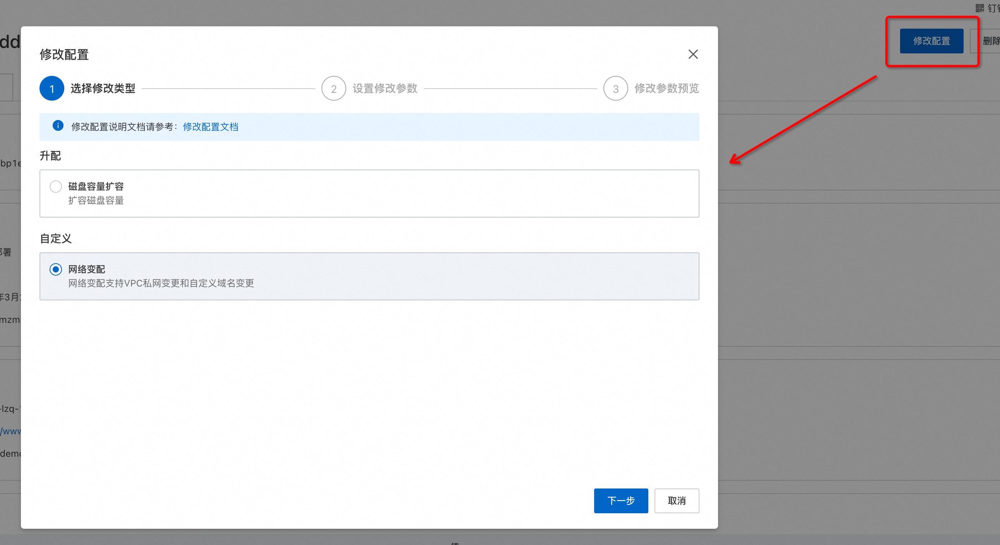
2. 点击**下一步**进入**设置修改参数**，添加私网连接参数。
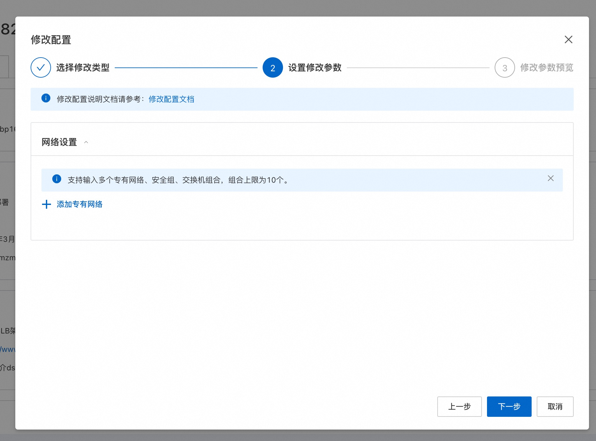
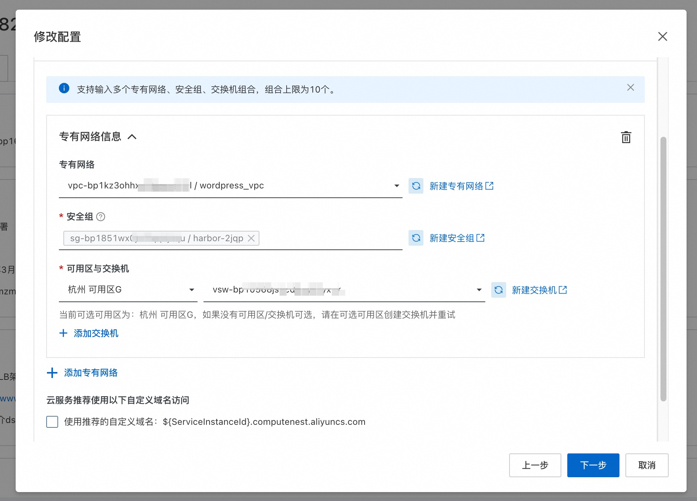
   注意：请确保填入的安全组入方向开启3306端口，否则私网访问将无法连接。
3. 点击**下一步**预览变配内容。
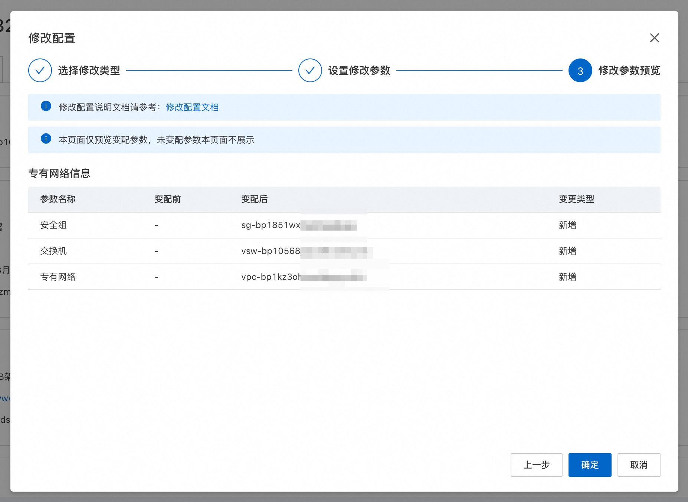
4. 点击**确定**开始执行变配，等待变配完成。
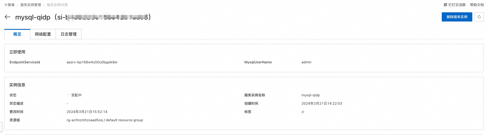
5. 变配完成，服务实例状态变为已部署，进入网络配置可见新增的私网连接信息。之后便可通过**部署流程**步骤5所述完成连接。
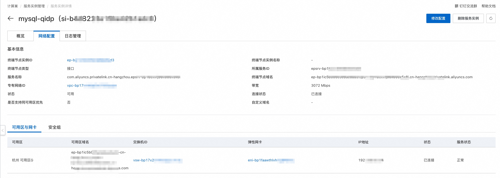
后续若需要关闭/新增/删除私网访问等其他操作，同样可以通过修改配置-网络变配完成。

### 磁盘容量扩容步骤

0. 前提说明 
   1. 本变配示例为用户扩容磁盘容量，服务模板中将"扩容磁盘容量"变配类型设置为升配，即仅能扩容；
   2. 为使磁盘可变配与脚本可执行，服务模板中资源EcsInstanceGroup参数UpdatePolicy需设置为ForAllInstances，资源RunCommand参数Sync需设置为true。
   以上参数模板中均已配置好，此处仅告知。
1. 点击右上角 **修改配置** 进入变配服务实例页面，选择**磁盘容量扩容**。
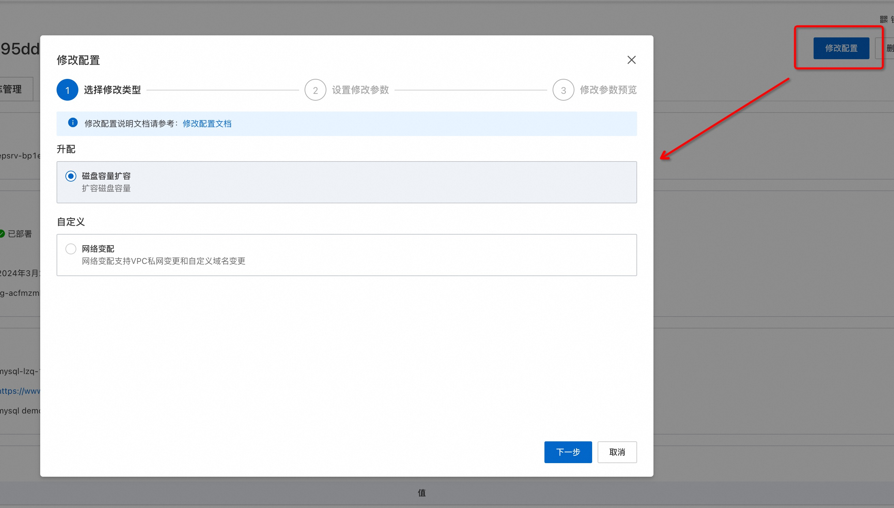
2. 点击**下一步**进入**设置修改参数**，将原有磁盘容量从200GB修改为400GB。
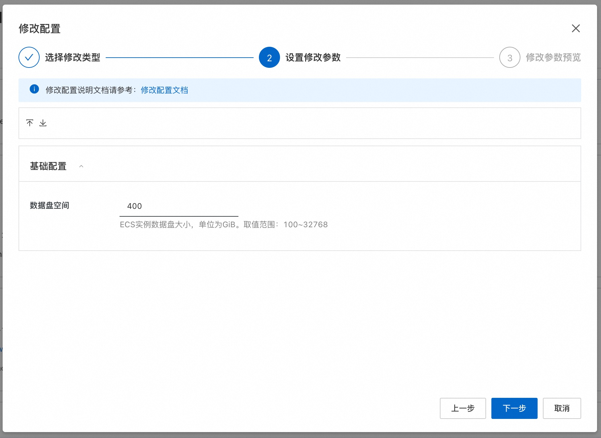
3. 点击**下一步**预览变配参数。
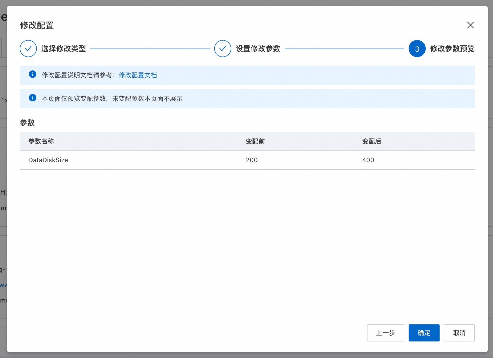
4. 点击确定开始执行变配，等待变配完成。

5. 变配完成，服务实例状态变为已部署。
6. 查看结果：进入服务端ECS 通过命令 df -h 查看，磁盘容量已修改:

    变配前：
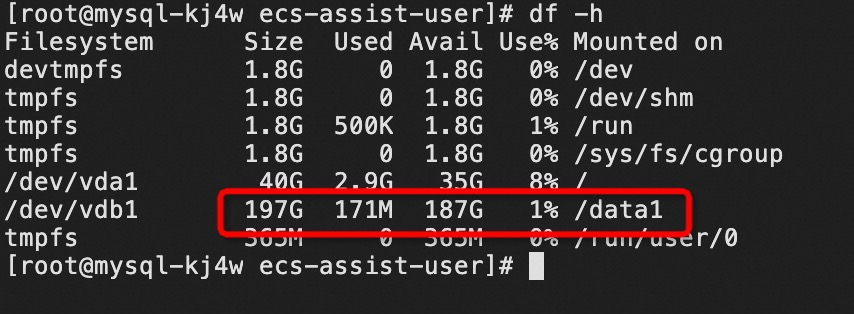
变配后：
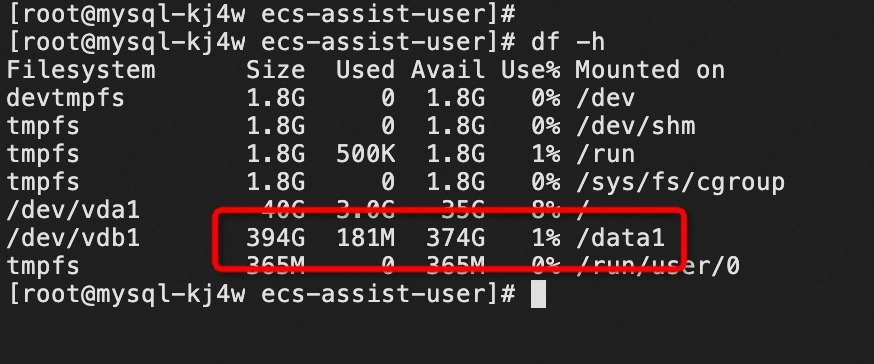


## 服务详细说明

本文提前将MySQL社区版安装包存放到该Github Repo中，构建服务过程中会将该安装包发布为计算巢部署物，并在ROS模板写入安装指令，ROS模板引擎在执行时便会自动执行安装了。

```bash
wget '{{ computenest::file::MySQL }}' -O mysql-community-release-el6-5.noarch.rpm
rpm -ivh mysql-community-release-el6-5.noarch.rpm
yum repolist all | grep mysql
yum install mysql-community-server -y
```

{{ computenest::file::MySQL }} 为占位符，会由计算巢服务替换成文件部署物MySQL的http下载地址

文件说明

| 文件路径                                              | 说明                                                                                                                   |
|---------------------------------------------------|----------------------------------------------------------------------------------------------------------------------|
| config.yaml                                       | 构建服务的配置文件，服务构建过程中会使用计算巢命令行工具[computenest-cli](https://pypi.org/project/computenest-cli/)，computenest-cli会基于该配置文件构建服务 |
| parameters.yaml                                   | 本服务为托管版单租，使用该文件渲染服务商需要配置的网络参数，包括VpcId，VSwitch等                                                                       |
| artifact/mysql-community-release-el6-5.noarch.rpm | MySQL社区版安装包，构建过程会将该包发布为计算巢部署物                                                                                        |
| icons/service_logo.jpg                            | 构建服务默认的图标                                                                                                            |
| templates/parameters.yaml                         | 本服务为托管版单租服务，所以只需要用户填写一部分参数，通过该文件指定用户所填参数                                                                             |
| templates/template.yaml                           | ROS模板文件，ROS模板引擎根据该模板能够自动创建出所有的资源                                                                                     |

templates/template.yaml主要由三部分组成

1. Parameters定义需要用户填写的参数，包括付费类型，实例规格和实例密码可用区参数

```
ZoneId:
 Type: String
 AssociationProperty: ALIYUN::ECS::Instance:ZoneId
 Label:
   en: VSwitch Available Zone
   zh-cn: 可用区
# 数据库root账户密码
Password:
 # 查询该参数时只输出星号（*）
 NoEcho: true
 Type: String
 Description:
   en: 'Database root account passwor, 8-32 characters, including uppercase and lowercase letters, numbers and special symbols (including: !@#$%^&*-+=_).'
   zh-cn: 数据库root账户密码，长度8-32个字符，可包含大小字母、数字及特殊符号（包含：!@#$%^&*-+=_）。
 Label:
   en: Root Account Password
   zh-cn: 数据库root账户密码
 ConstraintDescription:
   en: '8-32 characters, including uppercase and lowercase letters, numbers and special symbols (including: !@#$%^&*-+=_).'
   zh-cn: 8-32个字符，可包含大小字母、数字及特殊符号（包含：!@#$%^&*-+=_）。
 MinLength: '8'
 MaxLength: '32'
 AssociationProperty: ALIYUN::ECS::Instance::Password
# 专有网络VPC实例ID
VpcId:
 AssociationProperty: ALIYUN::ECS::VPC::VPCId
 Type: String
 Label:
   en: VPC ID
   zh-cn: 专有网络VPC实例ID
# 交换机实例ID
VSwitchId:
 AssociationProperty: ALIYUN::ECS::VSwitch::VSwitchId
 AssociationPropertyMetadata:
   VpcId: ${VpcId}
   ZoneId: ${ZoneId}
 Type: String
 Label:
   en: VSwitch ID
   zh-cn: 交换机实例ID
# 数据盘大小
DataDiskSize:
 Description:
   zh-cn: ECS实例数据盘大小，单位为GiB。取值范围：100~32768
   en: 'ECS Instance disk size, range of values: 100-32768, units: GB'
 Default: 200
 MaxValue: 32768
 MinValue: 100
 Label:
   zh-cn: 数据盘空间
   en: Data Disk Space
 Type: Number
# Ecs实例类型
EcsInstanceType:
 Type: String
 Label:
   en: Instance Type
   zh-cn: Ecs实例类型
 AssociationProperty: ALIYUN::ECS::Instance::InstanceType
 AllowedValues:
   - ecs.c6.large
   - ecs.c6.xlarge
   - ecs.c6.2xlarge
   - ecs.c6.4xlarge
SlbInstanceType:
 Type: String
 Label:
   en: Instance Type
   zh-cn: Slb实例类型
 AssociationProperty: ALIYUN::Slb::LoadBalance::LoadBalancerSpec
 AllowedValues:
   - slb.s1.small
   - slb.s3.small
```

2. Resources定义需要开的资源，包括新开的Vpc,、VSwitch、ECS、Slb实例、私网连接。

```
EcsSecurityGroup:
 Type: 'ALIYUN::ECS::SecurityGroup'
 Properties:
   VpcId:
     Ref: VpcId
   SecurityGroupIngress:
     - Priority: 1
       PortRange: 3306/3306
       NicType: internet
       SourceCidrIp: 0.0.0.0/0
       IpProtocol: tcp
# Ecs实例
EcsInstanceGroup:
 Type: ALIYUN::ECS::InstanceGroup
 Properties:
   # I/O优化实例
   IoOptimized: optimized
   ZoneId:
     Ref: ZoneId
   DiskMappings:
     - Category: cloud_essd
       Device: /dev/xvdb
       Size: 
         Ref: DataDiskSize
   SystemDiskSize: 40
   # 付费方式：按量付费
   InstanceChargeType: PostPaid
   MaxAmount: 1
   # 系统盘类型：cloud_essd
   SystemDiskCategory: cloud_essd
   # 实例名称
   InstanceName:
     Ref: ALIYUN::StackName
   VpcId:
     Ref: VpcId
   SecurityGroupId:
     Ref: EcsSecurityGroup
   VSwitchId:
     Ref: VSwitchId
   # 指定CentOS 7.9镜像，如果修改镜像，UserData脚本需要进行适配
   ImageId: "centos_7_9_x64_20G_alibase_20220727.vhd"
   InstanceType:
     Ref: EcsInstanceType
   # 主机名
   HostName:
     Ref: ALIYUN::StackName
   # Ecs登录密码
   Password:
     Ref: Password
   # 是否为实例分配公网IP
   AllocatePublicIP: true
   InternetMaxBandwidthOut: 1
# ECS执行脚本
  RunCommand:
    Type: ALIYUN::ECS::RunCommand
    Properties:
      CommandContent:
        Fn::Sub:
          - |
            #!/bin/sh
            FLAG_FILE="/root/.disk_initialized"
            PARTITION=/dev/vdb1
            MOUNT_POINT=/data1
            
            if [ ! -f "$FLAG_FILE" ]; then
              # cloud-init执行用户命令
              # /var/log/cloud-init.log /var/log/cloud-init-output.log 可以看到执行日志
              # /var/lib/cloud/instance/scripts/part-001 为具体的脚本 可以sh 执行来排查问题
            
              # sleep一段时间确保网络就绪
              sleep 10
              
              # 对数据盘进行分区
              
              cat >> /root/InitDataDisk.sh << EOF
              #!/bin/bash
              echo "p
              n
              p
              
              
              
              w
              " |  fdisk -u /dev/vdb
            EOF
              /bin/bash /root/InitDataDisk.sh
              rm -f /root/InitDataDisk.sh
              rm -f InitDataDisk.sh
              # 在新分区上创建文件系统
              mkfs.ext4 /dev/vdb1
              # 创建目录，MySQL将安装在该目录下
              mkdir /data1
              # 挂载文件系统
              mount /dev/vdb1 /data1
              # 向 /etc/fstab 写入新分区信息
              echo /dev/vdb1 /data1 ext4 defaults,nodelalloc,noatime 0 2 >> /etc/fstab
              cd /data1/
              
              # 安装社区版MySQL
              wget '{{ computenest::file::MySQL }}' -O mysql-community-release-el6-5.noarch.rpm
              rpm -ivh mysql-community-release-el6-5.noarch.rpm
              yum repolist all | grep mysql
              yum install mysql-community-server -y
              
              # 启动MySQL服务
              service mysqld start
              
              # 以超级用户身份登入，创建admin用户，并允许admin用户以Password为密码远程登录
              mysqladmin -u root password '${Password}'
              echo "create database test character set utf8 collate utf8_bin;" > ./test.sql
              echo "CREATE USER 'admin'@'%' IDENTIFIED BY '${Password}';" >> ./test.sql
              echo "GRANT ALL PRIVILEGES ON *.* TO 'admin'@'%' WITH GRANT OPTION;" >> ./test.sql
              mysql -u root -p'${Password}' < ./test.sql
              
              # 将MySQL的配置和数据路径移动到数据盘上
              systemctl stop mysqld
              rsync -av /var/lib/mysql /data1
              # 修改配置文件
              sed -i 's/\/var\/lib/\/data1/g' /etc/my.cnf
              echo -e '\n' >> /etc/my.cnf
              echo '[client]' >> /etc/my.cnf
              echo 'port=3306' >> /etc/my.cnf
              echo 'socket=/data1/mysql/mysql.sock' >> /etc/my.cnf
              # 重启MySQL
              systemctl start mysqld
            
              # 当初始化完成后，创建一个标志文件
              touch "$FLAG_FILE"
              echo "Initialization complete. Flag file created."
              
              # 执行成功回调WaitCondition结束WaitCondition的等待
              ${CurlCli} -d "{\"Data\" : \"SUCCESS\", \"Status\" : \"SUCCESS\"}"
              
            else
              # 标志文件存在，执行数据盘扩展操作
              # sleep一段时间确保网络就绪
              sleep 10
            
              # 停止MySQL服务
              systemctl stop mysqld
              
              # 检查并确保分区未被挂载
              if mountpoint -q $MOUNT_POINT; then
                umount $MOUNT_POINT
              fi
              
              # 使用 growpart 扩展分区
              echo "Expanding partition..."
              if ! growpart /dev/vdb 1; then
                echo "Failed to expand partition"
                exit 1
              fi
              
              # 通知系统分区的更改
              partprobe $PARTITION
              
              # 使用 e2fsck 检查文件系统
              echo "Checking filesystem..."
              e2fsck -f -y $PARTITION
              
              # 扩展文件系统
              echo "Resizing filesystem..."
              resize2fs $PARTITION
              
              # 重新挂载分区
              echo "Remounting partition..."
              mount $PARTITION $MOUNT_POINT
              
              # 启动MySQL服务
              echo "Starting MySQL service..."
              systemctl start mysqld
            fi
        # 获取到WaitConditionHandle的地址放到 ${CurlCli}变量里
          - CurlCli:
              Fn::GetAtt:
                - WaitConditionHandle
                - CurlCli
            # 数据库root账户密码
            Password:
              Ref: Password
      Type: RunShellScript
      Timeout: 900
      Sync: true
      InstanceIds:
        - Ref: EcsInstanceGroup
Slb:
 Type: ALIYUN::SLB::LoadBalancer
 Properties:
   LoadBalancerName:
     Fn::Join:
       - '-'
       - - mysql
         - Ref: ALIYUN::StackName
   VpcId:
     Ref: VpcId
   VSwitchId:
     Ref: VSwitchId
   PayType: PayOnDemand
   AddressType: intranet
   LoadBalancerSpec:
     Ref: SlbInstanceType
   SupportPrivateLink: true
SlbBackendServerAttachment:
 DependsOn:
   - EcsInstanceGroup
 Type: ALIYUN::SLB::BackendServerAttachment
 Properties:
   BackendServerList:
     Fn::GetAtt:
       - EcsInstanceGroup
       - InstanceIds
   LoadBalancerId:
     Ref: Slb
   BackendServerWeightList:
     - 100
     - 0
SlbListener:
 DependsOn: Slb
 Type: ALIYUN::SLB::Listener
 Properties:
   Persistence:
     CookieTimeout: 60
     StickySession: 'on'
     PersistenceTimeout: 180
     XForwardedFor: 'off'
     StickySessionType: insert
   ListenerPort: 3306
   Bandwidth: -1
   HealthCheck:
     HttpCode: http_2xx,http_3xx,http_4xx,http_5xx
     HealthCheckType: tcp
     UnhealthyThreshold: 3
     Timeout: 5
     HealthyThreshold: 3
     Port: 3306
     URI: /
     Interval: 2
   LoadBalancerId:
     Ref: Slb
   BackendServerPort: 3306
   Protocol: tcp
VpcEndpointService:
 DependsOn: Slb
 Type: ALIYUN::PrivateLink::VpcEndpointService
 Properties:
   ServiceDescription: isv service
   Resource:
     - ZoneId:
         Ref: ZoneId
       ResourceId:
         Ref: Slb
       ResourceType: slb
   AutoAcceptEnabled: true
```

3. Outputs定义需要最终在计算巢概览页中对用户展示的输出

```
Outputs:
  EndpointServiceId:
    Description:
      en: EndpointService Id
      zh-cn: 终端节点服务Id
    Value:
      Fn::GetAtt:
        - VpcEndpointService
        - ServiceId
  Endpoint:
    Value:
      Fn::Join:
        - ''
        - - Ref: ALIYUN::StackName
          - .mysql.com
  MysqlUserName:
    Description:
      en: MySQL User Name
      zh-cn: MySQL登录用户名
    Value: admin
```

## 服务配置

[创建代运维服务完成实例运维](https://help.aliyun.com/zh/compute-nest/create-a-hosted-operations-and-maintenance-service?spm=a2c4g.11186623.0.i24#task-2167552])

[创建包含变配功能的服务](https://help.aliyun.com/zh/compute-nest/use-cases/create-a-service-that-supports-specification-changes-and-change-the-specifications-of-a-service-instance?spm=a2c4g.11186623.0.i3])

[创建包含服务升级功能的服务](https://help.aliyun.com/zh/compute-nest/upgrade-a-service-instance?spm=a2c4g.11186623.0.i17#task-2236803)

## 服务交付

[自定义服务架构图](https://help.aliyun.com/zh/compute-nest/customize-a-service-architecture?spm=a2c4g.11186623.0.0.56e736bfyUdlFm])

[服务文档上线流程](https://help.aliyun.com/zh/compute-nest/use-cases/publish-documents-to-compute-nest?spm=a2c4g.313309.0.i0])

[将服务上架云市场并上到云市场售卖](https://help.aliyun.com/zh/compute-nest/publish-a-service-to-alibaba-cloud-marketplace?spm=a2c4g.11186623.0.i7])
